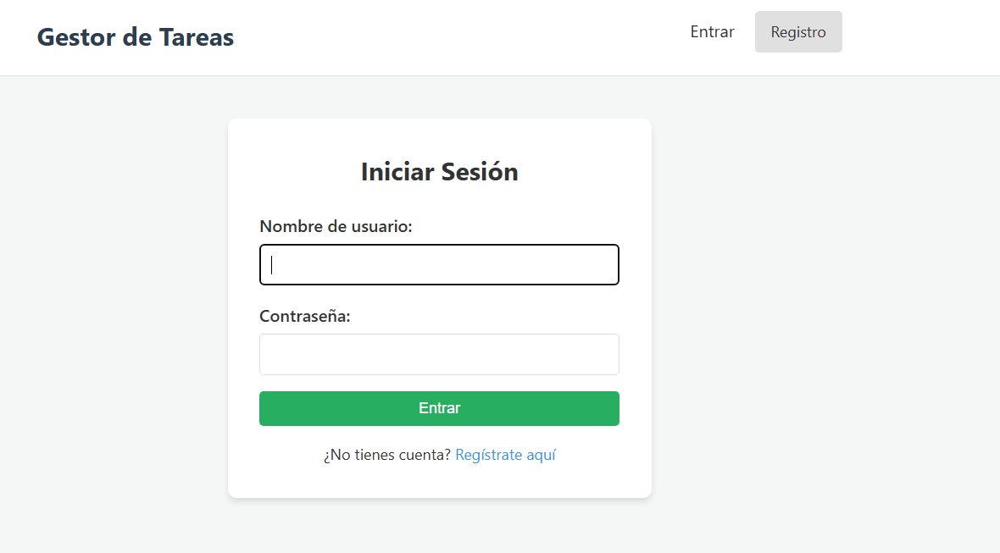
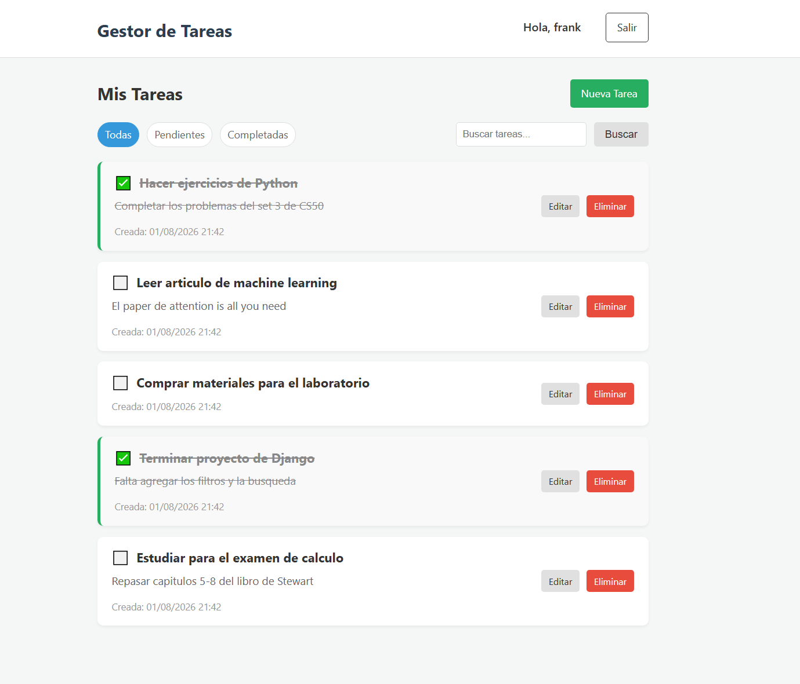
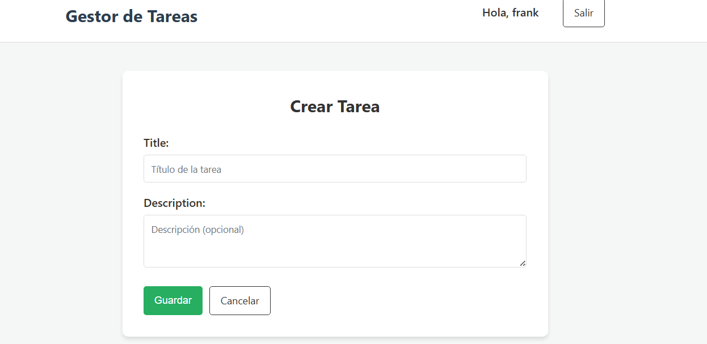

# Task Manager (Django)

Una aplicación web de gestión de tareas hecha con Django, diseñada como proyecto final. Permite a los usuarios registrarse, iniciar sesión y gestionar sus propias tareas de forma privada (crear, editar, marcar como completadas y eliminar).

## Características

- Autenticación de usuarios (registro, login, logout).
- CRUD completo de tareas asociado a cada usuario.
- Filtrado de tareas por estado (Todas, Pendientes, Completadas).
- Búsqueda simple por título.
- Interfaz limpia y responsive creada con CSS vanilla (sin frameworks).

## Screenshots

| Login | Lista de Tareas | Crear Tarea |
|-------|-----------------|-------------|
|  |  |  |

## Cómo ejecutarlo localmente

1. **Clonar el repositorio:**
   ```bash
   git clone <url-del-repo>
   cd task-manager-django
   ```

2. **Crear y activar entorno virtual (opcional pero recomendado):**
   ```bash
   python -m venv venv
   source venv/bin/activate  # En Windows: venv\Scripts\activate
   ```

3. **Instalar dependencias:**
   ```bash
   pip install -r requirements.txt
   ```

4. **Aplicar migraciones para configurar la base de datos:**
   ```bash
   python manage.py makemigrations
   python manage.py migrate
   ```

5. **Iniciar el servidor de desarrollo:**
   ```bash
   python manage.py runserver
   ```

6. **Abrir en el navegador:**
   Visita `http://127.0.0.1:8000` y crea una cuenta para empezar a usar la aplicación.

---
*Hecho con Django y CSS vanilla*
